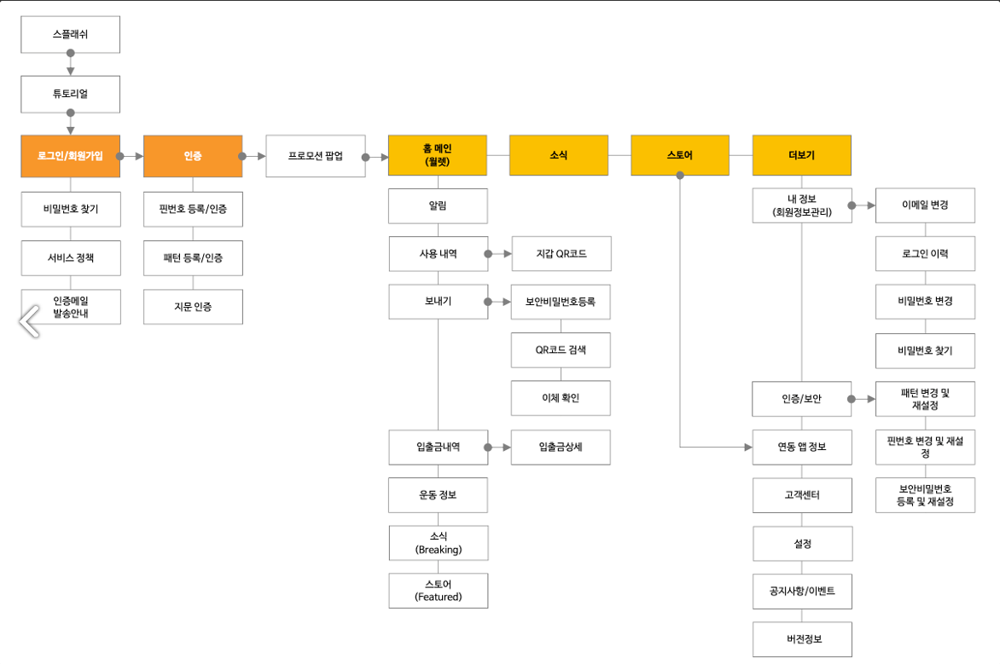
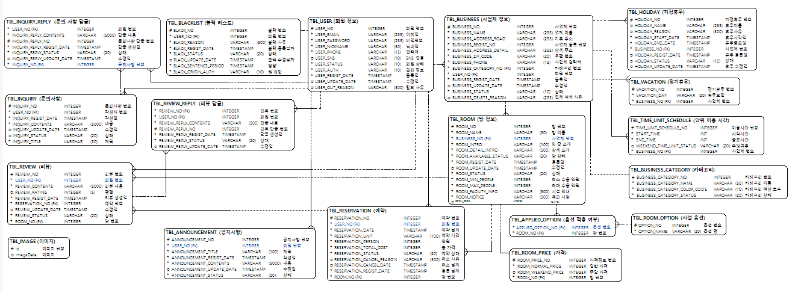

# BUNNY ROOM 

## 공간 대여 서비스

## Links
- <a href="https://github.com/yycBunnyRoom/SEMI_PROJECT-BUNNY_ROOM">Github</a>
- <a href="https://www.notion.so/YYC-97ee4c6b5825403682535b1270671756">Notion</a>
- <a href="https://www.figma.com/file/Ly8X5Fp4cGqGXcXdl9QCz1/%EB%B2%84%EB%8B%88-%EB%A3%B8?type=design&node-id=0%3A1&mode=design&t=o6UJiGAyKivR46ZT-1">Figma</a>

## Information Architecture

## ERD(물리)

## Architecture

## personal Role
|이름|역할|
|-------|-------|
|정유환|관리자 페이지 도메인 전반, 홈페이지 퍼블리싱 호스트 및 게스트 페이지 보조|
|유광중|HostManagement|
|이창주|GuestManagement|

## API 명세서

## File Structure

## Technical Decision

## 사용 라이브러리
1. Spring Web
2. thymeleaf
3. mysql driver
4. mybatis framework
5. Spring security
6. Spring dev tools
7. Spring mail
8. Spring validation
9. Redis
10. Lombok
11. Bootstrap

